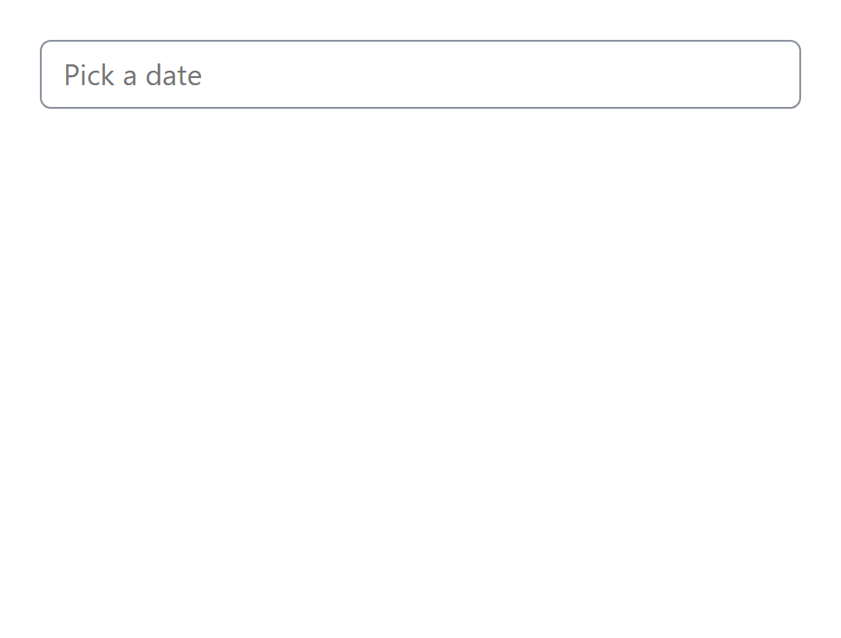
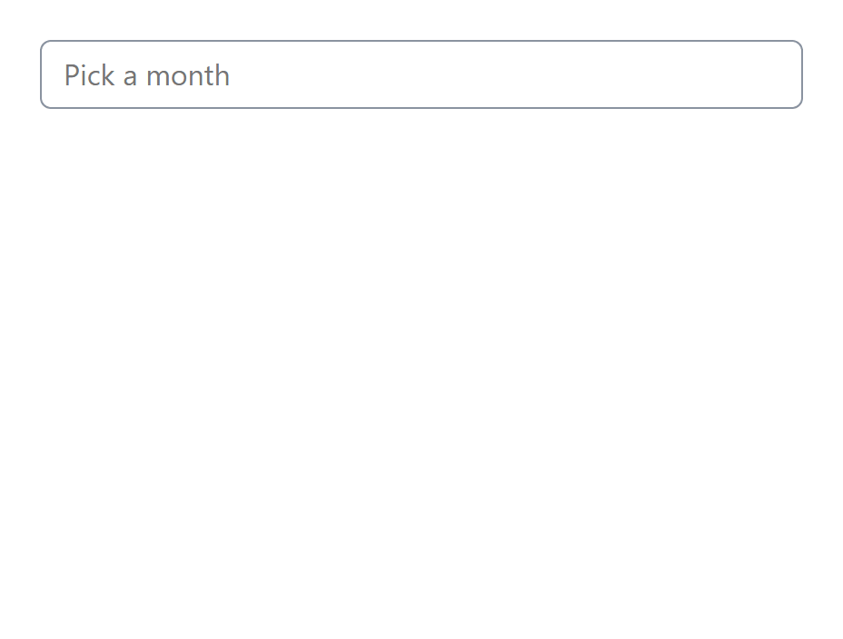

<p align="center">
	<picture>
		<source media="(prefers-color-scheme: dark)" srcset="static/logo_dsq_dark.svg">
		
	</picture>
</p>
<p align="center">
    
    
</p>

# dateSquirrel

**A year → month → day drill-down date picker with a nutty tang.**

Lives inside a single input. No modals, no extra fields, no runtime
dependencies. Works as a plain class, as a `<date-squirrel>` custom element, or
inside React, Vue and Svelte.

<p align="center">
  <picture>
    <source media="(prefers-color-scheme: dark)" srcset="static/demo-ymd-dark.gif" />
    
  </picture>
</p>

<p align="center"><em>
  Years stay on the left, months slide in over them, days slide up over both.
</em></p>

## Why this exists

`<input type="date">` is good now, and you should usually just use it. Two things
it still cannot do:

- **Pick a year and month without a day.** There is no natively supported "month"
  control, and a day grid is the wrong shape for "reporting month" or "card
  expiry".
- **Drill down through a wide range.** Picking a 1957 birthday by paging a month
  grid is miserable. Picking the year first is not.

Those two cases are the whole point of this chronological mamal. If you need a general-purpose day picker,
use the native one.

## Install

```sh
npm install date-squirrel
```

## Quick start

### As a custom element

```html
<link rel="stylesheet" href="node_modules/date-squirrel/dist/date-squirrel.css" />

<label for="month">Reporting month</label>
<date-squirrel mode="ym" min="2020-01" max="2030-12">
  <input id="month" name="reporting-month" />
</date-squirrel>

<script type="module">
  import 'date-squirrel/element';
</script>
```

The element enhances the `<input>` you give it, so `<label for>`, `name`, form
serialisation and every form library keep working. Omit the input and one is
created for you.

### As a class

```ts
import { DateSquirrel } from 'date-squirrel';
import 'date-squirrel/styles.css';

const picker = new DateSquirrel('#month', { mode: 'ym' });

picker.setValue('2026-07');
picker.valueAsString; // "2026-07"
picker.value;         // PlainDate { year: 2026, month: 6, day: 1 }
```

### In React

The picker dispatches real bubbling `input` and `change` events on the underlying
input, so `onChange`, React Hook Form and Formik all just work.

```tsx
import { useEffect, useRef } from 'react';
import { DateSquirrel } from 'date-squirrel';
import 'date-squirrel/styles.css';

function MonthField({ name, onChange }) {
  const ref = useRef<HTMLInputElement>(null);

  useEffect(() => {
    const picker = new DateSquirrel(ref.current!, { mode: 'ym' });
    const handler = (event: Event) => {
      onChange((event as CustomEvent).detail.save); // "2026-07"
    };
    picker.wrapper?.addEventListener('dsq:change', handler);
    return () => picker.destroy(); // removes every listener
  }, [onChange]);

  return <input ref={ref} name={name} />;
}
```

`destroy()` is complete and idempotent, so React 18/19 strict-mode double
mounting is safe. Importing the package on a server is also safe — see [SSR](#ssr).

## Modes

| Mode | User picks | Value | Default display | Default stored |
| :--- | :--- | :--- | :--- | :--- |
| `ymd` *(default)* | year → month → day | that day | `dx mmm yyyy` → `27th Jul 2026` | `yyyy-mm-dd` |
| `ym` | year → month | 1st of that month | `mmm yyyy` → `Jul 2026` | `yyyy-mm` |
| `y` | year | 1 January | `yyyy` → `2026` | `yyyy` |

<p align="center">
  <picture>
    <source media="(prefers-color-scheme: dark)" srcset="static/demo-ym-dark.gif" />
    
  </picture>
</p>

<p align="center"><em>
  <code>mode: 'ym'</code> — commits on the month, no day step.
</em></p>

```ts
new DateSquirrel('#birth-year', { mode: 'y', min: 1920, max: 2010 });
```

In `ym` and `y` mode the value is snapped to the start of the period, so
`setValue('2026-07-27')` in `ym` mode stores `2026-07`.

If `min` and `max` fall in the same year the picker starts on the month list; if
they fall in the same month it starts on the day grid.

## Options

| Option | Type | Default | Notes |
| :--- | :--- | :--- | :--- |
| `mode` | `'y' \| 'ym' \| 'ymd'` | `'ymd'` | See [Modes](#modes) |
| `min` | date, function, `null` | `null` | Also read from the input's `min` attribute |
| `max` | date, function, `null` | `null` | Defaults to ten years past `min` |
| `initial` | date, `null` | `null` | Set before any user input; fires no change event |
| `pattern` | string | per mode | Display format — see [Formatting](#formatting) |
| `patternSave` | string | per mode | Written to `data-dsq-date` |
| `locale` | BCP 47 tag(s) | browser locale | Month/weekday names, ordinals |
| `firstDayOfWeek` | `0`–`6` or `'auto'` | `'auto'` | `'auto'` follows the locale; `0` is Sunday |
| `monthNames` | `string[]` | from locale | Overrides long month names |
| `monthNamesShort` | `string[]` | from locale | Overrides short names; labels the month list |
| `disabledDates` | array or `false` | `false` | See [Disabled dates](#disabled-dates) |
| `markToday` | boolean | `true` | Rings the current day |
| `hideScrollbars` | boolean | `false` | Visual only; still scrollable |
| `overlay` | boolean | `false` | Float over the page instead of pushing it down |
| `closeOnSelect` | boolean | `true` | Close once the value is complete |
| `classPrefix` | string | `'dsq-'` | Changing it means shipping your own CSS |
| `activation` | `(input) => boolean` | `() => true` | Return `false` to leave the input alone |
| `callback` | function | no-op | Prefer the `dsq:change` event |
| `parse` | object or boolean | see below | Free-text parsing |

Any date-shaped option accepts a `PlainDate`, a `Date`, an ISO string
(`'2026-07-27'`, `'2026-07'`, `'2026'`), a `{ year, month, day }` object, or the
0.x `{ y, m, d }` shape. **Months are 0-indexed** (`0` = January), matching
`Date`. `{ d: 32 }` still means "last day of the month".

### `parse`

```ts
new DateSquirrel('#field', {
  parse: {
    active: true,     // re-format text the user types
    delay: 150,       // debounce, ms
    event: 'change',  // DOM event that triggers a parse
    rule: 'dmy',      // expected order of ambiguous numbers
  },
});

new DateSquirrel('#field', { parse: false }); // shorthand for { active: false }
```

`rule` is one of `'dmy'`, `'mdy'`, `'ymd'`, `'ydm'`. It only disambiguates bare
numbers — ISO input and textual months are recognised regardless, and a bare year
or `"Mar 2026"` resolves in `y` and `ym` mode.

## Disabled dates

Every entry is a rule, evaluated per cell rather than pre-expanded.

```ts
new DateSquirrel('#field', {
  disabledDates: [
    'sat', 'sun',                                     // recurring weekdays
    '--12-25',                                        // recurring date (ISO, 1-indexed month)
    '11/25',                                          // recurring date (0.x form, 0-indexed month)
    '2026-07-27',                                     // a single date
    new Date(2026, 6, 27),                            // ditto
    [new Date(2026, 0, 1), new Date(2026, 0, 31)],    // a range
    { from: '2026-03-01', to: '2026-03-31' },         // a range, named
    2026,                                             // a whole year
    5,                                                // a recurring month (June)
    (date) => date.day === 13 && date.weekday === 5,  // anything at all
  ],
});
```

A month is offered when at least one of its days is selectable, and a year when
at least one of its months is — so the three levels can never disagree.
Unrecognised entries are collected and reported in a single `console.warn`.

## Methods and properties

| Member | Returns | Notes |
| :--- | :--- | :--- |
| `value` | `PlainDate \| null` | The committed value |
| `valueAsDate` | `Date \| null` | Local midnight |
| `valueAsString` | `string` | Formatted with `patternSave` |
| `getValue()` | `PlainDate \| null` | 0.x-compatible |
| `getValue(pattern)` | `string` | Formatted with an ad-hoc pattern |
| `setValue(value, opts?)` | `boolean` | `false` if unparseable or not selectable |
| `clear(opts?)` | `void` | Empties the value, resets the drill-down |
| `openPanel()` / `closePanel()` | `void` | |
| `refresh()` | `void` | Re-read `min`/`max`/`disabledDates` and rebuild |
| `setOptions(patch)` | `void` | Change options in place |
| `destroy()` | `void` | Removes every listener and node; idempotent |
| `input`, `wrapper`, `options`, `mode`, `isOpen`, `active` | | |

`setValue` and `clear` accept `{ silent: true }` to skip the change event.

## Events

Dispatched on the wrapper, bubbling and composed:

| Event | `detail` |
| :--- | :--- |
| `dsq:change` | `{ date, human, save, mode }` |
| `dsq:open` | — |
| `dsq:close` | — |

Plus native bubbling `input` and `change` on the underlying `<input>`, written
through the prototype value setter so React's change tracker notices.

```ts
picker.wrapper.addEventListener('dsq:change', (event) => {
  const { date, human, save } = event.detail;
});
```

## Formatting

`format(date, pattern, { locale })` is exported and usable standalone.

| Token | Output | Token | Output |
| :--- | :--- | :--- | :--- |
| `yyyy` | 2026 | `wwww` | Monday |
| `yy` | 26 | `www` | Mon |
| `mmmm` | July | `ww` | M |
| `mmm` | Jul | `w` | 1 |
| `mm` | 07 | `dddd` | 208 (of year, padded) |
| `mx` | 7th | `dddx` | 208th |
| `m` | 7 | `ddd` | 208 |
| `dd` | 27 | `dx` | 27th |
| `d` | 27 | | |

`\` escapes the next character: `'\\d\\a\\y d'` → `day 27`.

Month and weekday names come from `Intl` in the active locale. Ordinal suffixes
are applied for English locales only.

## Theming

Every colour and metric is a CSS custom property, and all styles sit in a
`@layer`, so your own unlayered CSS wins without a specificity fight.

```css
.dsq {
  --dsq-primary: #b4185d;
  --dsq-selected: #f0a6c4;
  --dsq-row-height: 2.75rem;
  --dsq-radius: 0.75rem;
  --dsq-month-inset: 3.5rem;
}

/* No ID gymnastics needed any more: */
.dsq-day { border-radius: 0; }
```

See [`src/styles/date-squirrel.css`](src/styles/date-squirrel.css) for the full
list. Light and dark are both handled via `prefers-color-scheme`;
`data-theme="light|dark"` on `.dsq` forces one.

### Contrast

Every default text pair clears **WCAG AA (4.5:1)** against its own background in
both schemes, and non-text indicators clear 3:1.
[`test/contrast.test.ts`](test/contrast.test.ts) parses the stylesheet and fails
if a change drops below that, so run the tests when retuning the palette.

**Disabled dates are held to the same 4.5:1 as everything else.** WCAG exempts
inactive controls from contrast requirements, which is exactly why disabled dates
are normally unreadable — they were 1.94:1 here before. Since legible disabled
cells can no longer be identified *by* their low contrast, they also carry a
strikethrough (SC 1.4.1, Use of Colour) and `aria-disabled`.

Two other consequences worth knowing if you override the palette:

- **Disabled needs a pair of tokens per panel.** The year and day lists sit on a
  light surface, the month list sits on `--dsq-primary`; no single text colour is
  readable on both. Hence `--dsq-{year,month,day}-{surface,text}-disabled`.
- **Focus rings use `currentColor`.** No fixed colour clears 3:1 against both the
  light lists and the dark month panel, and `currentColor` is the cell's own text
  colour, which is already compliant against its own background.

If you set `--dsq-primary` to something much lighter or darker, re-check
`--dsq-on-primary` with it.

### Structure

```html
<div class="dsq" data-mode="ymd" data-stage="day" data-open="true">
  <input type="text" aria-haspopup="dialog" aria-expanded="true" data-dsq-date="2026-07-27">
  <div class="dsq-lists">
    <ul class="dsq-list-years" role="listbox" aria-label="Year">
      <li class="dsq-option" role="option" aria-selected="true" data-year="2026">2026</li>
    </ul>
    <ul class="dsq-list-months" role="listbox" aria-label="Month">
      <li class="dsq-option" role="option" data-month="6">Jul</li>
    </ul>
    <div class="dsq-days">
      <span class="dsq-side">
        <button type="button" class="dsq-reminder" data-action="back">
          <span class="dsq-reminder-month">Jul</span> <span class="dsq-reminder-year">2026</span>
        </button>
      </span>
      <div class="dsq-list-days" role="grid">
        <div class="dsq-dow" role="row">
          <span class="dsq-dow-header" role="columnheader">Mon</span>
        </div>
        <div class="dsq-week" role="row">
          <button type="button" class="dsq-day" role="gridcell" data-day="27">27</button>
        </div>
      </div>
    </div>
  </div>
</div>
```

State lives on `data-*` attributes (`data-open`, `data-stage`, `data-mode`,
`data-single-year`, `data-single-month`, `data-touch`), not in cumulative classes.

## Keyboard

| Key | Action |
| :--- | :--- |
| <kbd>↓</kbd> from the input | Open and enter the list |
| <kbd>↑</kbd> <kbd>↓</kbd> | Previous / next (a week at a time in the day grid) |
| <kbd>←</kbd> <kbd>→</kbd> | Previous / next day; <kbd>←</kbd> from the months returns to the years |
| <kbd>Home</kbd> <kbd>End</kbd> | First / last |
| <kbd>PgUp</kbd> <kbd>PgDn</kbd> | ±10 years, or a whole month |
| <kbd>Enter</kbd> <kbd>Space</kbd> | Select |
| <kbd>Backspace</kbd> | Back one stage |
| <kbd>Esc</kbd> | Close, keeping focus in the field |
| <kbd>Tab</kbd> | Close and move on |

Lists are ARIA listboxes; the day grid is an ARIA grid with a roving tabindex.
Disabled days stay focusable and are marked `aria-disabled`, so they are
discoverable rather than skipped.

## SSR

Importing `date-squirrel` or `date-squirrel/element` on a server does not throw.
The element class is built on first registration rather than at module load, and
`defineDateSquirrel()` is a no-op without a `customElements` registry.

The date logic runs anywhere, so the same rules can validate a submission:

```ts
import { PlainDate, Selectability, parseDisabledDates, parseDate } from 'date-squirrel';

const { rules } = parseDisabledDates(['sat', 'sun']);
const check = new Selectability({
  min: new PlainDate(2026, 0, 1),
  max: new PlainDate(2026, 11, 31),
  rules,
});

const submitted = parseDate(request.body.date);
if (!submitted || !check.isDaySelectable(submitted)) throw new Error('Not bookable');
```

## Browser support

Chrome/Edge 111+, Firefox 128+, Safari 16.5+. Uses CSS nesting, `color-mix()`,
cascade layers, `AbortController` listener signals and `Intl.DateTimeFormat`.

No IE support.

## Migrating from 1.x

Old code mostly keeps working — `start`/`end`, `day`/`month`, `disableDates`,
`monthList`, `callback`, `getValue`, `setValue` and `destroy` are all still
accepted. What changed:

| 1.x | 2.x |
| :--- | :--- |
| `new dsq(el, opts)` | `new DateSquirrel(el, opts)` |
| `day: false` | `mode: 'ym'` (old spelling still works) |
| `day: false, month: false` | `mode: 'y'` (old spelling still works) |
| `start` / `end` | `min` / `max` |
| `disableDates` / `disabledDates` | `disabledDates` (both accepted; 0.x disagreed with itself) |
| `monthList` | `monthNamesShort` |
| `parse.etype` | `parse.event` |
| SCSS variables | CSS custom properties |
| UMD / AMD builds | ESM + CJS; use `<script type="module">` for a tag drop-in |
| `<a class="dsq-reminder">` | `<button class="dsq-reminder">` |
| `ul.dsq-list-days > li` | `div.dsq-list-days > .dsq-week > button.dsq-day` |
| `.dsq-active` / `.dsq-month` / `.dsq-day` state classes | `data-open` / `data-stage` attributes |


## Development

```sh
npm install
npm run dev        # demo at http://localhost:5173/demo/
npm test           # vitest
npm run shots      # visual check in a real browser -> screenshots/
npm run gif        # rebuild the readme GIFs -> static/demo-*.gif
npm run build      # dist/ + .d.ts
npm run typecheck
npm run lint
```

`demo/` covers every option — modes, formats, locales, ranges, the full
disabled-dates matrix, overlay, theming and a linked date range.

`npm run shots` drives that demo in headless Chromium and writes a PNG per mode,
stage, theme and locale. jsdom has no layout, so the unit tests cannot see the
sliding panels or the overlay positioning.

`npm run gif` regenerates the GIFs at the top of this file from
[`demo/capture.html`](demo/capture.html). Playwright drives the picker and bursts
screenshots through each transition; [`gifenc`](https://github.com/mattdesl/gifenc)
encodes them. Both are pure JS — no ffmpeg or ImageMagick to install. Pass
`--frames` to also dump every frame as a PNG, which is the only practical way to
check the timing.

## Licence

MIT
